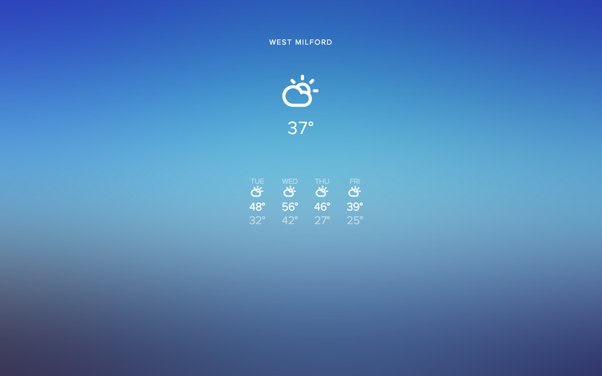

# SUN

A web-based weather dashboard that uses golang instead of javascript. You can see a live demo [here](http://prod.mauger.co)

# Screenshot

# Install

Download the source code and insert your IPStack and Wunderground API keys inside `main.go`, you can also change the service's port (default is `8080`). Then just build and run.
